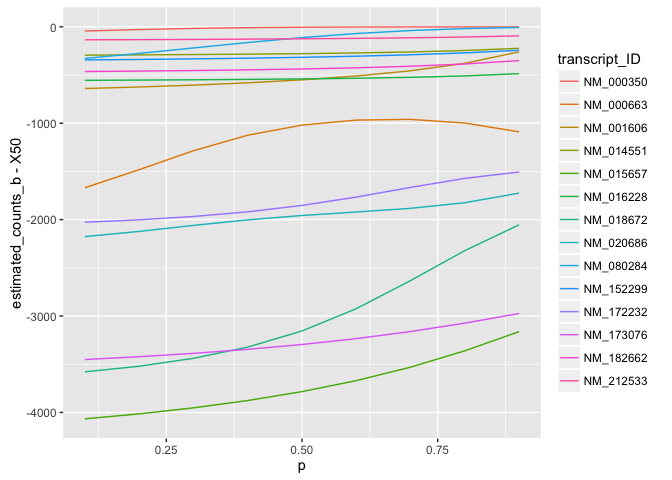
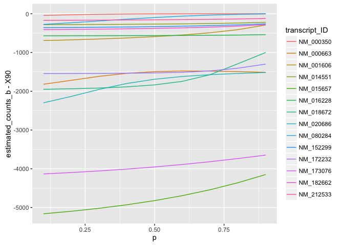

# scatter plot priors
Kornel Kiełczewski  
25 April 2016  


```r
library(dplyr)
```

```
## 
## Attaching package: 'dplyr'
```

```
## The following objects are masked from 'package:stats':
## 
##     filter, lag
```

```
## The following objects are masked from 'package:base':
## 
##     intersect, setdiff, setequal, union
```

```r
real.mix <- read.csv('real-counts.tsv', sep = '\t')
```


```r
results50 <- data.frame()

for (p in seq(0.1, 0.9, 0.1)) {
  b <- read.csv(paste0('out50/type_b_', p, '.temt'), sep = '\t', col.names = c('transcript_ID', 'estimated_counts_b', 'RPKM_b'))
  b <- b %>% inner_join(real.mix, by = c('transcript_ID' = 'transcript_ID'))
  b$p <- p
  results50 <- rbind(results50, b)
}

library(ggplot2)

ggplot(results50) + geom_line(aes(p, estimated_counts_b - X50, color = transcript_ID))
```




```r
results90 <- data.frame()

for (p in seq(0.1, 0.9, 0.1)) {
  b <- read.csv(paste0('out90/type_b_', p, '.temt'), sep = '\t', col.names = c('transcript_ID', 'estimated_counts_b', 'RPKM_b'))
  b <- b %>% inner_join(real.mix, by = c('transcript_ID' = 'transcript_ID'))
  b$p <- p
  b$p <- p
  results90 <- rbind(results90, b)
}

library(ggplot2)

ggplot(results90) + geom_line(aes(p, estimated_counts_b - X90, color = transcript_ID))
```


